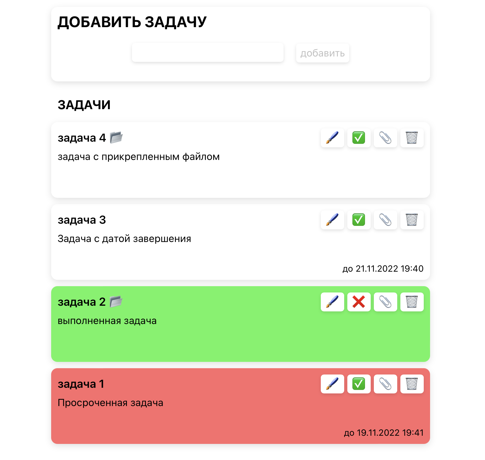

# Тестовое задание для WomanUp

## Задание

Что нужно сделать — написать todo-лист

Функционал:

-   создание, просмотр, редактирование (изменение полей или то, что задача выполнена) и удаление задачи
-   возможность прикрепления файлов к записи
-   поля в задаче: заголовок, описание, дата завершения, прикрепленные файлы
-   если дата завершения истекла или задача выполнена, это должно быть визуально отмечено

## [Демо](https://front-test-4d257.web.app)

